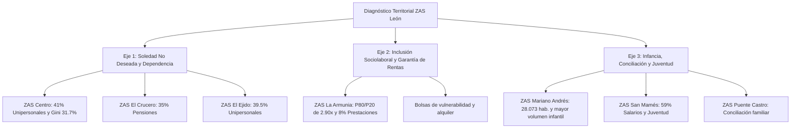

# Informe Ejecutivo: Diagnóstico Socioterritorial por Zonas de Acción Social (ZAS) de León (2026)

**Análisis Comparativo y Estratégico de los Informes Estadísticos Municipales**  
*Fuente: Observatorio Municipal para la Inclusión Social de León (ObservaLE) / Explotación de microdatos INE y Servicios Sociales (Agosto 2026)*

---

## 1. Introducción y Contexto de la División Territorial de León

El municipio de León estructura su intervención comunitaria y de Servicios Sociales en **7 Zonas de Acción Social (ZAS)**, que abarcan a la totalidad de los **124.091 residentes empadronados**. 

El análisis comparativo de los informes estadísticos oficiales revela que **la vulnerabilidad no es homogénea ni se concentra en un único distrito**, sino que presenta patrones diferenciados según la tipología urbana, la pirámide etaria y la estructura de rentas:

* **Distritos Centrales e Históricos:** Caracterizados por rentas medias superiores pero con una **fuerte polarización interna (Gini elevado)** y la mayor concentración de **soledad no deseada y hogares unipersonales** en personas mayores.
* **Distritos Populares Consolidados:** Caracterizados por un gran volumen poblacional, base de rentas salariales medias y demandas centradas en la **infancia, conciliación y empleo juvenil**.
* **Distritos Periféricos / Periurbanos:** Con menor volumen demográfico pero con **mayores ratios de disparidad económica** y dependencia de prestaciones de garantía social.

---

## 2. Cuadro Comparativo Global de las 7 Zonas de Acción Social

| Zona de Acción Social (ZAS) | Población Total | Hogares Unipersonales | Salarios (% Renta) | Pensiones (% Renta) | Índice Gini | Ratio P80/P20 | Foco Estratégico Prioritario |
| :--- | :---: | :---: | :---: | :---: | :---: | :---: | :--- |
| **1. León - Centro** | 13.396 hab. | **41,0%** *(Máximo)* | 46,0% | 28,0% | **31,70%** *(Máximo)* | 2,70x | Soledad en mayores y vulnerabilidad oculta |
| **2. León - El Crucero - La Vega** | 11.477 hab. | 36,5% | 51,0% | **35,0%** *(Máximo)* | 28,90% | 2,50x | Dependencia, cuidados y apoyo domiciliario |
| **3. León - El Ejido - Santa Ana** | 22.482 hab. | **39,5%** | 52,0% | 31,0% | 28,50% | 2,50x | Envejecimiento, soledad y cohesión vecinal |
| **4. León - La Armunia** | 8.312 hab. | 36,7% | 52,0% | 30,0% | 30,60% | **2,90x** *(Máximo)* | Inclusión sociolaboral y garantía habitacional |
| **5. León - Mariano Andrés** | **28.073 hab.** *(Mayor)* | 37,0% | 57,0% | 28,0% | 28,10% | 2,50x | Infancia en riesgo, familias y juventud |
| **6. León - Puente Castro** | 21.731 hab. | 36,9% | 55,0% | 29,0% | 28,90% | 2,60x | Servicios de proximidad, conciliación y mayores |
| **7. León - San Mamés - San Pedro** | 18.620 hab. | 37,0% | **59,0%** *(Máximo)* | 28,0% | 28,40% | 2,60x | Convivencia intergeneracional y apoyo social |
| **Media del Municipio de León** | **124.091 hab.** | **38,8%** | **53,5%** | **29,2%** | **30,80%** | **2,70x** | **Marco Global de Inclusión Social** |

---

## 3. Diagnóstico Detallado Zona a Zona

### 3.1. ZAS 1: León - Centro (13.396 habitantes)
* **Perfil Socioeconómico:** Presenta la **renta media más alta de la ciudad** (47.319 € por hogar y 22.433 € por persona), pero simultáneamente registra la **mayor polarización y desigualdad interna (Índice de Gini del 31,70%)**.
* **Estructura Demográfica y Hogar:** Máxima proporción de **hogares unipersonales (41,0%)** del municipio. Coexisten rentas profesionales elevadas con un colectivo vulnerable de personas mayores viudas con pensiones mínimas en viviendas antiguas.
* **Fuentes de Ingresos:** Los salarios representan solo el 46,0% de la masa de renta, con un 28,0% procedente de pensiones y un peso significativo de rentas del capital/patrimoniales (22,0%).
* **Prioridad para Servicios Sociales:** Detección de la **"soledad no deseada silenciosa"**, accesibilidad en fincas residenciales antiguas sin ascensor y teleasistencia avanzada.

---

### 3.2. ZAS 2: León - El Crucero - La Vega (11.477 habitantes)
* **Perfil Socioeconómico:** Distrito de perfil obrero tradicional y comercio de proximidad al oeste del río Bernesga.
* **Estructura Demográfica y Renta:** Es la zona con la **mayor dependencia de pensiones públicas de toda la ciudad (35,0% de todos los ingresos del distrito)**, superando ampliamente la media de León (29,2%).
* **Fuentes de Ingresos:** Salarios 51,0%, Pensiones 35,0%, Prestaciones por desempleo 2,0%, Otras prestaciones asistenciales 5,0%.
* **Prioridad para Servicios Sociales:** Refuerzo del **Servicio de Ayuda a Domicilio (SAD)**, centros de día, fisioterapia preventiva y programas de respiro para cuidadores familiares.

---

### 3.3. ZAS 3: León - El Ejido - Santa Ana (22.482 habitantes)
* **Perfil Socioeconómico:** Es la **segunda ZAS más poblada de León**, abarcando barrios consolidados del este y sureste urbano con una densidad residencial notable.
* **Estructura de Hogares:** Registra la **segunda mayor tasa de hogares unipersonales de la ciudad (39,5%)**, combinada con un peso de pensiones del 31,0%.
* **Desigualdad:** Índice de Gini moderado (28,50%) y ratio P80/P20 de 2,50x, indicando una relativa homogeneidad socioeconómica de clase trabajadora media.
* **Prioridad para Servicios Sociales:** Redes comunitarias de acompañamiento vecinal, programas activos de lucha contra la soledad no deseada y apoyo a familias con personas mayores a cargo.

---

### 3.4. ZAS 4: León - La Armunia (8.312 habitantes)
* **Perfil Socioeconómico:** Es la ZAS de menor tamaño demográfico pero la que presenta la **mayor brecha de disparidad entre extremos de renta (Ratio P80/P20 de 2,90x)** y un índice de Gini elevado (**30,60%**).
* **Dependencia Asistencial:** Registra la **tasa más alta de dependencia de "otras prestaciones sociales de asistencia y garantía de rentas" (8,0%)** de todo el municipio (el doble de la media de León, 4,3%).
* **Prioridad para Servicios Sociales:** **Inserción sociolaboral activa**, acompañamiento a familias en situación de vulnerabilidad severa, mediación social y acceso a vivienda digna.

---

### 3.5. ZAS 5: León - Mariano Andrés (28.073 habitantes)
* **Perfil Socioeconómico:** Es la **ZAS más poblada de León** (aglutina a más del 22% de todos los habitantes del municipio).
* **Estructura Laboral y Demográfica:** Presenta una base trabajadora amplia con un **57,0% de ingresos procedentes de salarios** y un 28,0% de pensiones. Presenta la menor desigualdad interna de la ciudad (**Gini 28,10%** y P80/P20 de 2,50x).
* **Infancia y Juventud:** Concentra el mayor volumen absoluto de menores de 18 años y familias trabajadoras del municipio.
* **Prioridad para Servicios Sociales:** **Becas de comedor escolar**, refuerzo socioeducativo, programas de juventud, conciliación laboral y apoyo a familias monomarentales.

---

### 3.6. ZAS 6: León - Puente Castro (21.731 habitantes)
* **Perfil Socioeconómico:** Gran distrito del sur y sureste municipal que incluye barrios tradicionales y desarrollos urbanos residenciales más recientes (como La Lastra).
* **Estructura de Ingresos:** Salarios 55,0%, Pensiones 29,0%, Prestaciones por desempleo 1,0%, Otras prestaciones 4,0%.
* **Desigualdad:** Índice de Gini del 28,90% y ratio P80/P20 de 2,60x.
* **Prioridad para Servicios Sociales:** Despliegue de **equipamientos sociales de proximidad**, actividades sociocomunitarias intergeneracionales y apoyo a la movilidad y transporte adaptado para personas mayores.

---

### 3.7. ZAS 7: León - San Mamés - San Pedro (18.620 habitantes)
* **Perfil Socioeconómico:** Distrito con fuerte vinculación universitaria y comercial, situado al norte de la ciudad.
* **Estructura Laboral:** Es la ZAS con el **mayor porcentaje de renta procedente de salarios (59,0%)** de todo León.
* **Hogares y Juventud:** Coexisten hogares de personas mayores solas (37,0% de hogares unipersonales) con una alta presencia de estudiantes y jóvenes emancipados en régimen de alquiler.
* **Prioridad para Servicios Sociales:** Programas de **convivencia intergeneracional** (ancianos y estudiantes compartiendo vivienda), orientación laboral para jóvenes y seguimiento a mayores que viven solos.

---

## 4. Matriz Estratégica de Intervención para los Servicios Sociales Municipales

A partir de los resultados cuantitativos de los 7 informes ZAS, se establecen 3 ejes estratégicos de asignación de recursos municipales:

---

## 5. Repositorio de Informes Estadísticos Oficiales Descargados

Todos los informes completos en formato PDF (8 páginas cada uno) generados por la plataforma interactiva de ObservaLE se encuentran disponibles en la carpeta local [`Informes estadisticos/`](file:///c:/Users/Pruebas%20IA/Documents/MCPs/MCP%20Notebook/observale%2020/Informes%20estadisticos):

1. **León - Centro:** [`Informe_ZAS_Centro.pdf`](file:///c:/Users/Pruebas%20IA/Documents/MCPs/MCP%20Notebook/observale%2020/Informes%20estadisticos/Informe_ZAS_Centro.pdf)
2. **León - El Crucero - La Vega:** [`Informe_ZAS_El_Crucero_-_La_Vega.pdf`](file:///c:/Users/Pruebas%20IA/Documents/MCPs/MCP%20Notebook/observale%2020/Informes%20estadisticos/Informe_ZAS_El_Crucero_-_La_Vega.pdf)
3. **León - El Ejido - Santa Ana:** [`Informe_ZAS_El_Egido_-_Santa_Ana.pdf`](file:///c:/Users/Pruebas%20IA/Documents/MCPs/MCP%20Notebook/observale%2020/Informes%20estadisticos/Informe_ZAS_El_Egido_-_Santa_Ana.pdf)
4. **León - La Armunia:** [`Informe_ZAS_La_Armunia.pdf`](file:///c:/Users/Pruebas%20IA/Documents/MCPs/MCP%20Notebook/observale%2020/Informes%20estadisticos/Informe_ZAS_La_Armunia.pdf)
5. **León - Mariano Andrés:** [`Informe_ZAS_Mariano_Andres.pdf`](file:///c:/Users/Pruebas%20IA/Documents/MCPs/MCP%20Notebook/observale%2020/Informes%20estadisticos/Informe_ZAS_Mariano_Andres.pdf)
6. **León - Puente Castro:** [`Informe_ZAS_Puente_Castro.pdf`](file:///c:/Users/Pruebas%20IA/Documents/MCPs/MCP%20Notebook/observale%2020/Informes%20estadisticos/Informe_ZAS_Puente_Castro.pdf)
7. **León - San Mamés - San Pedro:** [`Informe_ZAS_San_Mames_-_San_Pedro.pdf`](file:///c:/Users/Pruebas%20IA/Documents/MCPs/MCP%20Notebook/observale%2020/Informes%20estadisticos/Informe_ZAS_San_Mames_-_San_Pedro.pdf)
8. **Informe Global Municipio de León:** [`informeLeon.pdf`](file:///c:/Users/Pruebas%20IA/Documents/MCPs/MCP%20Notebook/observale%2020/Informes%20estadisticos/informeLeon.pdf)

---
